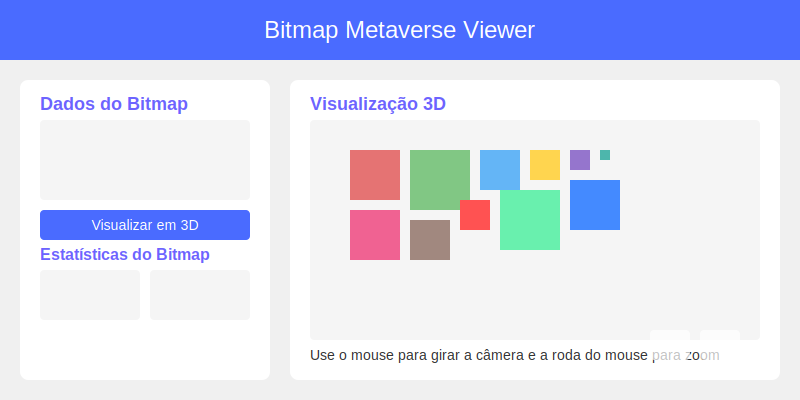

# Bitmap Multiverso Bitcoin Community

An interactive 3D visualization tool for metaverse spaces based on bitmap data.



## Overview

The Bitmap Metaverse Viewer transforms sequences of numbers into interactive 3D representations, where each number represents the size of a block in the metaverse space. This project uses advanced layout algorithms to organize blocks efficiently, creating a visually appealing and navigable representation of your metaverse space.

## Live Demo

Experience the Bitmap Metaverse Viewer online:

- [multiverso.club](https://multiverso.club) - Main site
- [GitHub Pages](https://0xcindyv.github.io/multiverso/) - Alternative version

## Key Features

- **Interactive 3D Visualization**: Explore your metaverse space in 3D with intuitive camera controls
- **Spaceship Navigation**: Control a virtual spaceship to fly through your metaverse space
- **Collision Detection**: Experience realistic interactions with blocks in the environment
- **Data Analysis**: View detailed statistics about your space, including size distribution
- **Sharing Capabilities**: Share your space with others via URLs or social media
- **Image Export**: Capture and save images of your 3D visualization
- **Configuration Management**: Save and load different bitmap configurations
- **File Import/Export**: Import and export your data in TXT and JSON formats
- **Responsive Interface**: Works seamlessly on both desktop and mobile devices

## Technologies

- **React**: UI library for building the application interface
- **TypeScript**: Type-safe JavaScript for robust code
- **Three.js**: 3D rendering library for the browser
- **React Three Fiber**: React renderer for Three.js
- **React Three Drei**: Useful components for React Three Fiber
- **GSAP**: Animation library for smooth transitions
- **Vite**: Fast build tool for web development

## Installation

1. Clone the repository:
   ```bash
   git clone https://github.com/0xcindyv/multiverso.git
   cd multiverso
   ```

2. Navigate to the project directory:
   ```bash
   cd metaverse-project
   ```

3. Install dependencies:
   ```bash
   npm install
   ```

4. Start the development server:
   ```bash
   npm run dev
   ```

5. Open your browser and visit `http://localhost:5173`

## Usage Guide

### Basic Usage

1. **Input Data**: Enter comma-separated values in the input field (e.g., `5,6,4,3,2,1`)
2. **Visualize**: Click "Visualize in 3D" to generate the visualization
3. **Explore**: Use mouse/touch to rotate the camera and mouse wheel/pinch to zoom

### Advanced Features

#### Spaceship Navigation
- **W/A/S/D**: Move the spaceship forward, left, backward, right
- **Q/E**: Rotate the spaceship left/right
- **Space**: Ascend
- **Shift**: Descend
- **F**: Toggle focus mode on a specific plot

#### Plot Management
- **Click on a block**: Highlight and get information about it
- **Enter plot number**: Jump directly to a specific plot
- **Tab**: Cycle through plots

#### Data Management
- **Save Configuration**: Name and save your current bitmap data
- **Load Configuration**: Select from previously saved configurations
- **Export as TXT/JSON**: Save your data in different formats
- **Import from file**: Load data from TXT or JSON files

#### Visualization Options
- **Toggle Collision Boxes**: Press 'C' to show/hide collision detection boundaries
- **Toggle Statistics**: View detailed statistics about your bitmap data
- **Toggle Plot Counter**: Show/hide the plot counter interface

## Data Format

The viewer accepts a list of comma-separated numbers, where each number represents the size of a block in the space. For example:

```
5,6,6,5,6,5,7,5,5,6,6,8,5,5,5,5,6,5,4,6,5,5,5,5,5,6,5,5,5,5,5,7,5,7,5,5,5,5,5,5,5,5,5,4,5,5,5,5,5,5,5,4,5,5,4,5,5,5,5,4,4,5,4,6,4,5,4,5,5,4,4,4,5,5,6,5,5,4,4,6,5,4,5,5,5,4,5,4,5,5,4,4,4,4,4,3,4,3,3,3,5,5,4,3,3,3,2,3,4,3,5,4,3,3,3,4,3,4,5,2,4,5,5,5,5,5,4,5,4,4,4,4,3,4,3,5,5,4,5,4,4,3,5,4,4,5,5,5,5,3,4,5,5,3,4,4,5,2,3,5,4,5,5,5,5,4,4,3,4,4,3,4,4,3,3,3,4,3,4,3,4,4,4,4,4,3,3,4,3,4,4,4,4,4,4,4,3,4,4,4,4,4,3,3,3,4,4,4,4,4,3,3,3,3,4,3,3,4,3,3,4,3,4,1,3,3,3,4,2,4,3,4,5,2,3,4,3,3,3,4,3,3,4,3,2,2,2,3,3,2,2,3,3,2,2,2,4,3,3,3,1,3,2,1,1,1,1,1,4,2,3,1,2,1,2,4,2,2,8,3,3,4
```

### Supported File Formats

- **TXT**: Simple text file containing comma-separated values
- **JSON**: JSON file with the following structure:
  ```json
  {
    "bitmap": [5, 5, 4, 3, 2, 1],
    "createdAt": "2024-03-08T12:00:00.000Z",
    "format": "bitmap-metaverse-viewer"
  }
  ```

## MondrianLayout Algorithm

The MondrianLayout algorithm is used to efficiently organize blocks in space, inspired by the artistic style of Piet Mondrian. The algorithm works as follows:

1. Calculates the total space needed based on block sizes
2. Places each block in the available space, starting with the largest
3. Fills empty spaces with smaller blocks
4. Creates a visually balanced layout that maximizes space utilization

## Project Structure

- `src/components/MetaverseViewer.tsx` - Main 3D visualization component
- `src/components/BitmapStats.tsx` - Component for displaying bitmap statistics
- `src/components/SavedConfigs.tsx` - Component for managing saved configurations
- `src/components/ShareDialog.tsx` - Component for sharing visualizations
- `src/components/FileOperations.tsx` - Component for file import/export
- `src/components/PlotCounter.jsx` - Component for counting and navigating plots
- `src/utils/MondrianLayout.ts` - Algorithm for block organization
- `src/utils/bitmapStats.ts` - Utility for calculating bitmap statistics
- `src/utils/storage.ts` - Utility for storing and retrieving configurations
- `src/utils/urlParams.ts` - Utility for managing URL parameters
- `src/utils/fileUtils.ts` - Utility for file import/export
- `src/App.tsx` - Main application component
- `src/App.css` - Application styles

## Performance Considerations

The Bitmap Metaverse Viewer is optimized for performance, even with large datasets:

- **Efficient Rendering**: Uses Three.js optimizations for smooth performance
- **Lazy Loading**: Components load only when needed
- **Memoization**: Prevents unnecessary recalculations
- **Collision Detection**: Optimized algorithms for real-time interaction
- **Responsive Design**: Adapts to different screen sizes and devices

## Browser Compatibility

The Bitmap Metaverse Viewer works best in modern browsers that support WebGL:

- Chrome (recommended)
- Firefox
- Safari
- Edge

## Contributing

Contributions are welcome! Feel free to open issues or submit pull requests.

1. Fork the project
2. Create your feature branch (`git checkout -b feature/amazing-feature`)
3. Commit your changes (`git commit -m 'Add amazing feature'`)
4. Push to the branch (`git push origin feature/amazing-feature`)
5. Open a Pull Request

## License

This project is licensed under the MIT License - see the LICENSE file for details.

## Acknowledgments

- Inspired by the [BitFeed Project](https://github.com/bitfeed-project/bitfeed) by @mononaut
- Three.js community for their excellent documentation and examples
- React Three Fiber team for making Three.js integration with React seamless
