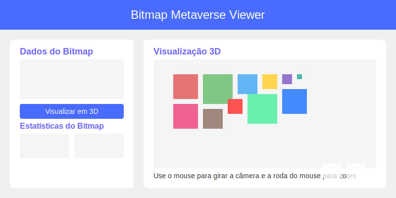

# Bitmap Metaverse Viewer

Um visualizador 3D interativo para espaços no metaverso baseados em dados de bitmap.



## Sobre o Projeto

Este projeto permite visualizar espaços no metaverso usando dados de bitmap. Ele transforma uma sequência de números em uma representação 3D interativa, onde cada número representa o tamanho de um bloco no espaço.

O visualizador usa o algoritmo MondrianLayout para organizar os blocos de forma eficiente, criando uma representação visual do seu espaço no metaverso.

## Funcionalidades

- **Visualização 3D Interativa**: Explore seu espaço no metaverso em 3D com controles de câmera intuitivos
- **Análise de Dados**: Visualize estatísticas detalhadas sobre seu espaço, incluindo distribuição de tamanhos
- **Compartilhamento**: Compartilhe seu espaço com outros através de URLs ou redes sociais
- **Exportação de Imagens**: Capture e salve imagens da sua visualização 3D
- **Salvamento de Configurações**: Salve e carregue diferentes configurações de bitmap
- **Importação/Exportação de Arquivos**: Importe e exporte seus dados em formatos TXT e JSON
- **Interface Responsiva**: Funciona em dispositivos desktop e móveis

## Tecnologias Utilizadas

- **React**: Biblioteca para construção de interfaces de usuário
- **TypeScript**: Superset tipado de JavaScript
- **Three.js**: Biblioteca para renderização 3D no navegador
- **React Three Fiber**: Renderizador React para Three.js
- **React Three Drei**: Componentes úteis para React Three Fiber
- **Vite**: Ferramenta de build rápida para desenvolvimento web

## Como Executar

1. Clone o repositório:
   ```
   git clone https://github.com/seu-usuario/bitmap-metaverse-viewer.git
   cd bitmap-metaverse-viewer
   ```

2. Instale as dependências:
   ```
   npm install
   ```

3. Execute o projeto em modo de desenvolvimento:
   ```
   npm run dev
   ```

4. Acesse o visualizador em `http://localhost:5173`

## Como Usar

1. **Inserir Dados**: Insira os valores do bitmap separados por vírgula no campo de texto
2. **Visualizar em 3D**: Clique em "Visualizar em 3D" para gerar a visualização
3. **Explorar**: Use o mouse para girar a câmera e a roda do mouse para zoom
4. **Interagir**: Clique em um bloco para destacá-lo e passe o mouse sobre um bloco para ver informações
5. **Exportar**: Clique no botão "Exportar Imagem" para salvar a visualização atual
6. **Compartilhar**: Clique no botão "Compartilhar" para compartilhar sua visualização
7. **Salvar**: Salve suas configurações para uso futuro
8. **Importar/Exportar**: Importe e exporte seus dados em formatos TXT e JSON

## Formato dos Dados

O visualizador aceita uma lista de números separados por vírgula, onde cada número representa o tamanho de um bloco no espaço. Por exemplo:

```
5,5,4,3,2,1
```

Isso criará 6 blocos com tamanhos 5, 5, 4, 3, 2 e 1, respectivamente.

### Formatos de Arquivo Suportados

- **TXT**: Arquivo de texto simples contendo os valores separados por vírgula
- **JSON**: Arquivo JSON com a seguinte estrutura:
  ```json
  {
    "bitmap": [5, 5, 4, 3, 2, 1],
    "createdAt": "2024-03-08T12:00:00.000Z",
    "format": "bitmap-metaverse-viewer"
  }
  ```

## Algoritmo MondrianLayout

O algoritmo MondrianLayout é usado para organizar os blocos de forma eficiente no espaço. Ele funciona da seguinte maneira:

1. Calcula o tamanho total do espaço necessário
2. Coloca cada bloco no espaço disponível, começando pelos maiores
3. Preenche os espaços vazios com blocos menores
4. Cria um layout visualmente equilibrado

## Estrutura do Projeto

- `src/components/MetaverseViewer.tsx` - Componente principal de visualização 3D
- `src/components/BitmapStats.tsx` - Componente para exibir estatísticas do bitmap
- `src/components/SavedConfigs.tsx` - Componente para gerenciar configurações salvas
- `src/components/ShareDialog.tsx` - Componente para compartilhar visualizações
- `src/components/FileOperations.tsx` - Componente para importação/exportação de arquivos
- `src/utils/MondrianLayout.ts` - Algoritmo para organização dos blocos
- `src/utils/bitmapStats.ts` - Utilitário para calcular estatísticas do bitmap
- `src/utils/storage.ts` - Utilitário para armazenar e recuperar configurações
- `src/utils/urlParams.ts` - Utilitário para gerenciar parâmetros de URL
- `src/utils/fileUtils.ts` - Utilitário para importação/exportação de arquivos
- `src/App.tsx` - Componente principal da aplicação
- `src/App.css` - Estilos da aplicação

## Contribuindo

Contribuições são bem-vindas! Sinta-se à vontade para abrir issues ou enviar pull requests.

1. Faça um fork do projeto
2. Crie uma branch para sua feature (`git checkout -b feature/nova-feature`)
3. Faça commit das suas mudanças (`git commit -m 'Adiciona nova feature'`)
4. Faça push para a branch (`git push origin feature/nova-feature`)
5. Abra um Pull Request

## Licença

Este projeto está licenciado sob a licença MIT - veja o arquivo LICENSE para mais detalhes.
